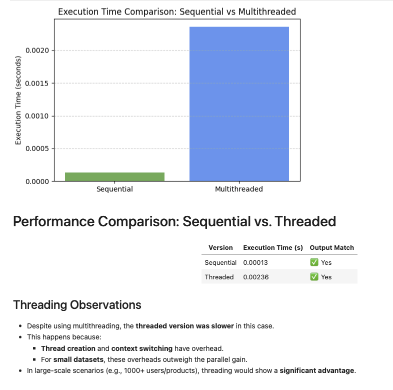

# Matrix-Based Recommendation System with Multithreading

This project implements a simple yet illustrative recommendation system using **matrix multiplication** and explores **multithreading** to simulate scalable performance.

Author: **Tiago Rafael Conti Fortunato**

---

## 🧠 Objective

To simulate a recommendation engine where:
- Users have preferences over categories
- Products belong to one or more categories
- Scores are calculated by multiplying user preferences with product-category associations

---

## 📐 Matrix Overview

- `U (users × categories)` → user preferences
- `P (categories × products)` → product feature associations
- `S = U × P` → recommendation scores

Includes both:
- Sequential version
- Multithreaded version (one thread per user)

---

## ⚙️ Features

- Matrix multiplication for recommendation scores
- Score normalization based on product complexity
- Execution time comparison (Sequential vs Threaded)
- Final visualization with bar chart
- Markdown explanations for clarity

---

## 📊 Results

- For small datasets, multithreading was actually **slower**
- Overhead from thread creation/context switching
- But for large-scale systems, parallelism has big potential

---

## 🔥 Technologies

- Python
- NumPy
- Threading module
- Matplotlib

---

## 📸 Output Preview

---

## 🧠 Notes

> This project is an introductory exercise to understand the concept of parallel computation in Python using threads.

